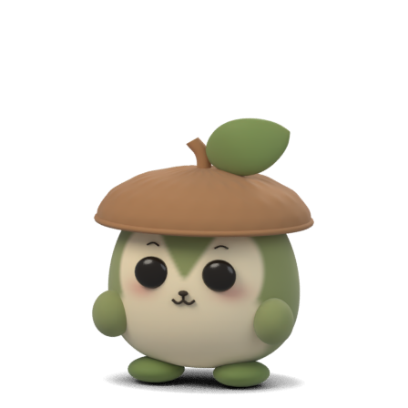

# Spriglet

**A little quiet company for your Mac.**

Meet Acorn Hopper: a tiny, round desktop companion with a wobbly cap, quick hops, and a happy little reaction when you pet it. Built with SwiftUI and AppKit, with an editable Blender character and pre-rendered 3D animation.



[Acorn's animations and Blender source](art/candidates/README.md) · [Latest tagged preview](https://github.com/eyenpi/spriglet/releases/tag/v0.2.0-preview.1) · [Changelog](CHANGELOG.md) · [Privacy](PRIVACY.md)

## Current development: one tiny pet

`main` now ships **Acorn Hopper only**, with no character picker. Its Small / Standard / Large canvases measure **72 / 96 / 120 points**; the standard character itself is about 64 points tall. Hops take 0.8 seconds, petting finishes with a soft settle, and nap/wake have authored transitions. Clicking during a hop queues the reaction after landing; petting a sleeping Acorn wakes it first. Rest and sleep hold a still image without a running animation clock.

New pets are named Acorn. Existing saved names and settings stay intact. Other editable models remain future source material, not bundled alternatives. The [asset boundary and reproducible export](tools/CharacterAssets/README.md) keep future character support separate from today's minimal experience. To try Acorn, clone `main` without the tag option below and run `./scripts/run.sh`.

## Try the public preview

The latest tagged release is **0.2.0 Preview 1 — Everyday companion** (app version 0.2.0, build 3). That earlier release still features Sprout; Acorn Hopper is currently on `main`. The preview brings native Settings, personality and return-home strolls, firefly play, accessibility actions, and optional sound and launch at login. [Read every change](CHANGELOG.md).

You need an **Apple silicon Mac**, **macOS 26 or later**, and **full Xcode** selected as your developer toolchain. This is a source preview; a signed, notarized app download is not available yet.

```sh
git clone --branch v0.2.0-preview.1 --depth 1 https://github.com/eyenpi/spriglet.git
cd spriglet
./scripts/run.sh
```

The quick guide introduces Spriglet on your first launch. It lives in the **leaf menu in your menu bar**, without a Dock icon. Open **Settings…** there to choose its name, size, and behavior. Pet, play, pause, and quit from the same menu.

- **Click to pet.** Sprout reacts, then gently settles.
- **Drag to move.** Its home position is remembered on this Mac.
- **Stay parked or stroll.** Parked Mode starts on. Turn it off for occasional short excursions that return to their starting spot on the same display. Automatic Moments, Pause, and Hide remain easy to reach.
- **Play with a firefly.** Watch its glow, catch it, and settle. When strolls are allowed, Sprout follows it and walks home; parked play stays in place.
- **Make it yours.** Choose a name, Small / Standard / Large size, and Quiet / Balanced / Lively frequency. Its stable traits and modest recent preferences give its finite routines variety.
- **Keep sound optional.** Brief petting and play chimes start off. Launch at login is also an explicit choice in Settings.
- **Stay in control.** Whole-window click-through, app-scoped keyboard commands, native accessibility actions, and Reduce Motion support are built in.

## Local by design

No account, server, analytics, desktop capture, or access to other apps' contents. Preferences stay on your Mac. Spriglet requests no Screen Recording, Accessibility, Input Monitoring, or Automation permission. [Read the privacy details](PRIVACY.md).

## What is included

Current source includes one Acorn pet, both hopping directions, idle, pet/settle, nap/wake transitions and held awake/sleep poses, native Settings and a quick guide, purposeful movement, personality, and the editable model/rig. The source-to-render-to-playback pipeline includes checks for transparency, foot contact, frame timing, cancellation, and quiet rest. The idle → walk → pet → settle sample and technical checks remain available in the separate Developer Diagnostics window in Debug builds or with `--diagnostics`.

It is an early public preview. Broader desktop coverage, sustained battery profiling, additional selectable pets, and signed distribution are still ahead. Transparent margins of the floating window can affect clicks; **Pass Clicks Through** is the supported fallback. The pet may remain visible over full-screen apps; use **Hide Pet** or **Pass Clicks Through** when needed. The [archived Sprout demo](https://github.com/eyenpi/spriglet/releases/download/v0.1.0-preview.1/spriglet-demo.mp4) shows that earlier character's animation and is not a desktop screen recording.

## Build, contribute, and create

The Acorn integration is built with **Xcode 27.0 and macOS SDK 27.0**, using Swift 6 mode and a macOS 26 deployment target. The app has no third-party runtime dependencies or remote Swift packages. New platform choices are checked against current official Apple/Swift documentation and the installed SDK.

Use a full checkout of `main` for development. The command above checks out the tagged preview for trying that release.

- [Character and motion checks](tools/CharacterSampleValidation/README.md)
- [Native size and accessibility checks](tools/EverydayExperienceValidation/README.md)
- [Sound and login service checks](tools/EverydayServicesValidation/README.md)
- [Shipping Acorn asset architecture and export](tools/CharacterAssets/README.md)
- [Original Sprout source and legacy fixture](art/sprout/README.md)
- [App icon artwork and export](art/app-icon/README.md)
- [Refined Acorn Hopper and Moss Mouse, animations and native comparison](art/candidates/README.md)
- [Release packaging](tools/ReleaseValidation/README.md)
- [Changelog and tag publishing](tools/ReleaseNotes/README.md)
- [Contributing](CONTRIBUTING.md)
- [Report a bug or suggest an idea](https://github.com/eyenpi/spriglet/issues)

Run Swift Testing with `./scripts/test.sh`. Build without launching with `./scripts/build.sh Debug` or `./scripts/build.sh Release`. CI checks public history, Swift tests, Python validators, every animation frame, app builds, and silent service adapters; desktop fixtures compile in CI and run separately on a visible Mac session.

## Keyboard and accessibility

Use **⌘,** for Settings while Spriglet is active. The Companion menu lists app-scoped commands; it installs no global shortcut monitor.

| Action | Shortcut |
| --- | --- |
| Pet / Firefly | ⌥⌘P / ⌥⌘F |
| Parked Mode | ⌥⌘K |
| Pause / Resume | ⌥⌘. |
| Hide / Show Pet | ⇧⌘H |
| Short walk / Home | ⌥⌘W / ⌥⌘R |
| Move pet | ⌥⌘arrow key |

The pet exposes its name, state, size, primary petting action, and custom play, pause, parking, placement, and Settings actions to accessibility clients. Standard native controls support keyboard navigation. VoiceOver speech/rotor review, real login registration and the next-login launch, and actual Mac sleep/wake remain manual acceptance checks. Native provider, adapter, and simulated lifecycle checks do not establish those results.

Sound starts off and only deliberate petting, play, or Preview Sound can request a finite chime. Launch at Login uses macOS’s own registration status and changes only when you choose it. Keep an opted-in installation in a stable location.

Spriglet was developed with AI assistance. GitHub Copilot CLI contributed the public preview's welcome and everyday controls. The underlying app and Blender pipeline predate that contribution.

## License

**MIT for code and original artwork/audio**, including the editable character, rig, animation frames, chimes, and demo. See [LICENSE](LICENSE) and [ASSETS.md](ASSETS.md).
