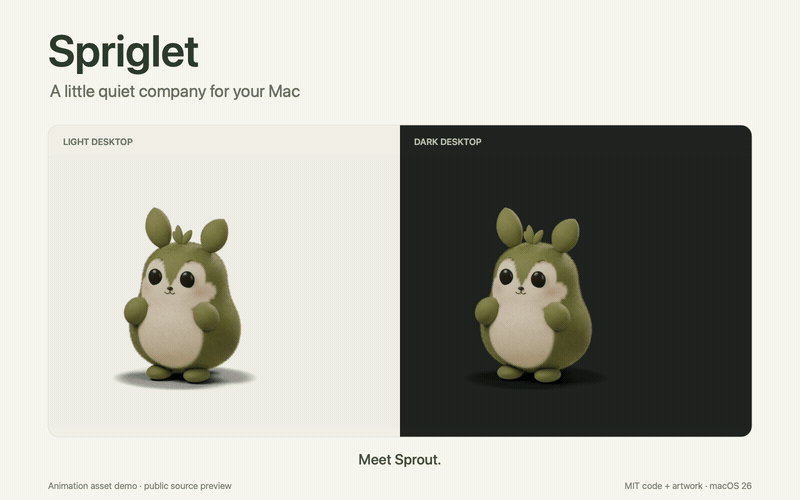

# Spriglet

**A little quiet company for your Mac.**

Meet Sprout: a soft, leaf-eared desktop companion that rests, takes a few steps, and perks up when you pet it. Built with SwiftUI and AppKit, with an editable Blender character and pre-rendered 3D animation.



[Watch the demo](docs/media/spriglet-demo.mp4) · [Character and animation pipeline](docs/character-sample.md) · [Privacy](PRIVACY.md)

## Try the public preview

You need an **Apple silicon Mac**, **macOS 26 or later**, and **full Xcode** selected as your developer toolchain. This release is a source preview; a signed, notarized app download is not available yet.

```sh
git clone https://github.com/eyenpi/spriglet.git
cd spriglet
./scripts/run.sh
```

The welcome shows you around on your first launch. Spriglet lives in the **leaf menu in your menu bar**, without a Dock icon. Open **Spriglet Controls…** there to replay the full sample or change its behavior. Quit from the same menu.

- **Click to pet.** Sprout reacts, then gently settles.
- **Drag to move.** Its home position is remembered on this Mac.
- **Play the sample.** Idle → a short walk → petting reaction → settle, in about six seconds. Walking poses and desktop movement share the same timing.
- **Keep it quiet.** Choose occasional idle moments and naps, or turn Quiet Behavior off. Pause and Hide are always available.
- **Stay in control.** Whole-window click-through, keyboard-accessible placement buttons, and Reduce Motion support are built in.

## Local by design

No account, server, analytics, desktop capture, or access to other apps' contents. Preferences stay on your Mac. Spriglet requests no Screen Recording, Accessibility, Input Monitoring, or Automation permission. [Read the privacy details](PRIVACY.md).

## What is included

This preview includes one finished character sample, both walking directions, static awake/nap poses, a native welcome and controls, and the editable model/rig. The source-to-render-to-playback pipeline includes checks for transparency, foot contact, frame timing, cancellation, and quiet rest.

It is an early public preview. The larger animation library, broader Spaces/full-screen/display testing, sustained battery profiling, and signed distribution are still ahead. Transparent margins of the floating window can affect clicks; **Pass Clicks Through** is the deterministic fallback. The comparison demo is composed from the app's actual assets and motion metadata; it is not a desktop screen recording.

## Build, contribute, and create

Development is verified with **Xcode 26.6, Swift 6.3.3, and macOS SDK 26.5**. The app has no third-party runtime dependencies or remote Swift packages. New platform choices are checked against current official Apple/Swift documentation and the installed SDK.

- [Development and checks](docs/development.md)
- [Editable character source](art/sprout/README.md)
- [Distribution preparation](docs/distribution.md)
- [Contributing](CONTRIBUTING.md)
- [Report a bug or suggest an idea](https://github.com/eyenpi/spriglet/issues)

Spriglet was developed with AI assistance. GitHub Copilot CLI contributed the public preview's welcome and everyday controls; [the contribution record](docs/copilot-contribution.md) describes the scope. The underlying app and Blender pipeline predate that contribution.

## License

**MIT for both code and artwork**, including the editable character, rig, animation frames, and demo. See [LICENSE](LICENSE) and [ASSETS.md](ASSETS.md).
