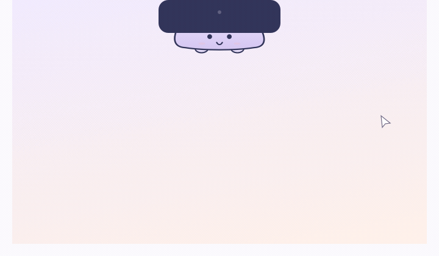

# Spriglet · Mallow

A soft, local desktop companion for Apple silicon Macs running macOS 26 or later. Mallow rests beneath the notch with its face visible, blinking and breathing while you work. It has no action cards, settings window or permanent menu-bar controls.

Its curious peek stays in place. Breathing gently changes pace and depth; blinks vary in timing and occasionally come in pairs. Brief glances and tiny settling movements are separated by long, irregular pauses. These quiet moments yield to nearby pointer attention, hover and deliberate interaction. Reduce Motion keeps blinking while suppressing decorative movement.

Hover for a small reaction. Click to invite it out; touch again for a wave or swing. Drag to pick it up. While held close enough to catch home, Mallow looks up and reaches slightly; release there to let it catch, or away from home for gravity and a squishy landing. Click elsewhere to return it to its resting peek. On a display without a notch, it rests at the upper right edge below the menu bar.

This is the first Mallow release, `v0.3.0-preview.1` (app 0.3.0, build 5). Downloads are on [GitHub releases](https://github.com/eyenpi/spriglet/releases/tag/v0.3.0-preview.1); choose the `LOCAL-UNSIGNED.dmg` for drag-to-Applications installation or the ZIP. macOS may block an unsigned download. Plugins and assistant services are not implemented. The local app uses ad hoc signing; it has not been Apple-notarized or submitted to the App Store.



The preview above uses the production simulation and renderer on a simulated desktop.

## Build and run

Select the full Xcode 26 toolchain, then:

```sh
./scripts/test.sh
./scripts/build.sh Debug
./scripts/build.sh Release
./scripts/run.sh
```

Builds live under `.build/xcode/Build/Products/`. Reopening the app from Finder returns Mallow to its resting home without activating the app. Right-click returns it home and opens a small menu with Launch at Login, the current macOS registration status, Login Items settings and Quit Spriglet. Launch, recovery and character interaction preserve keyboard focus. Escape returns it home when this app receives keyboard input. Overlapping launches share one process-held lock, so a second executable exits without creating another companion. After acquiring the lock, startup also exits if macOS reports an already-launched Spriglet, including an older preview without the lock.

Launch at login is optional and off for a new installation. Enable it from Mallow’s right-click menu. The checkmark means macOS reports `.enabled`; a dash means `.requiresApproval`, with login launch still off until you allow it in System Settings > General > Login Items & Extensions. Unavailable states and failed changes are shown explicitly, including the macOS error when a change fails. The menu re-reads registration when opened and before each action, so changes in System Settings are reflected. Quitting leaves the registration intact; turning the option off unregisters future login launches while Mallow keeps running. Startup never registers automatically or restores an old preference.

For a finite, reproducible animation preview using the production code:

```sh
./scripts/preview.sh .build/preview/frames
./scripts/preview.sh .build/preview/transitions --transitions
./scripts/preview.sh .build/preview/interaction --interaction
./scripts/preview.sh .build/preview/idle --idle
```

The exporter writes PNG frames locally. The transition sequence renders at 60 fps and covers emergence, grabbing during emergence, regrabbing a catch, reversing a retreat, a rapid upward throw and returning during a horizontal reversal. The interaction sequence covers a transparent-corner press, dragging away, returning into catch range, the upward look and release. The idle sequence shows two uninterrupted minutes at the normal 20 fps resting cadence, with reproducible timing and no pointer overlay. It runs no assistant service and reads no desktop content.

## Architecture

There is one production simulation and one renderer. The preview exporter uses those same modules.

| Layer | Location | Responsibility |
| --- | --- | --- |
| Core | `Packages/CompanionKit/Sources/CompanionCore` | Geometry, interaction state, fixed-step physics, pose blending, frame policy and typed commands. Pure Swift values; no AppKit, timers, files or networking. |
| Rendering | `Packages/CompanionKit/Sources/CompanionRendering` | Draw immutable snapshots as vector artwork. No engine references, events, window ownership or clocks. |
| macOS environment | `Sources/Spriglet/Environment` | Convert real display measurements and lifecycle signals into core values. Observe outside clicks without reading clicked content. |
| Desktop host | `Sources/Spriglet/Desktop` | Transparent nonactivating panel, actual-frame coordinate compensation, hit testing and accessible character actions. |
| Runtime | `Sources/Spriglet/Runtime` | Wire the three boundaries together and own the single screen-bound animation clock. |
| App | `Sources/Spriglet/App` | Exclusive launch lease, shutdown, login registration, transient app controls and generated shared text. |

`AppDelegate` owns the app menu and `LaunchAtLoginController`; `MainAppLoginService` is the only ServiceManagement adapter and uses `SMAppService.mainApp`. Registration is independent of character state, and the app passes a menu factory through the runtime and window host to the view. No helper app, launch-agent plist, polling timer or persisted login boolean is needed.

`CompanionRuntime` is the character composition root. It owns a `CompanionEngine`, `DesktopEnvironment`, `CompanionWindowHost` and `ScreenFrameClock`. Adapters report to the runtime; they never call one another. Core state is held in a session value and advances in 120 Hz simulation steps, independently of display cadence. The renderer receives a `CompanionSnapshot` and cannot mutate the model.

### Changing behavior

Add a semantic input or command in `CompanionInput.swift`. Interaction transitions belong in `InteractionState.swift` and `CompanionEngine.swift`; trajectories, contact and weight belong in `BodyPhysics.swift`; authored pose targets belong in `MotionAnimator.swift`. `PoseDynamics.swift` carries silhouette and limb velocity across target changes and derives width from height to conserve body area. `JumpTrajectory.swift` joins flight endpoints with matching velocities. Preserve the existing pose and momentum when a motion changes. Keep scene measurements and coordinate conversion outside behavior code.

`IdleAnimation.swift` owns natural rhythms and finite quiet pose variations. Blinks pause for roughly 3–8 seconds, breathing cycles vary over roughly 4–6 seconds, and each glance or settling moment is followed by 18–38 seconds of quiet. Only one quiet moment runs at a time; it does not change presence, reveal, body position or cadence. The engine supplies quiet eligibility and motion policy, the animator layers deliberate gestures over the idle pose, and pose dynamics blend the result. The runtime supplies a fresh seed per session; tests and previews supply repeatable seeds. Recovery clears pending expressions and starts a fresh quiet interval without replaying suspended time.

Hands use one continuous attachment value in the snapshot. The renderer blends free and home hand positions and lets the home housing occlude them as they emerge; it has no reveal threshold or gesture-triggered arm switch.

`MallowGeometry.swift` supplies the shared body curves, pose transforms, gait feet and hand paths. Picking follows that painted silhouette, including outlines, rotation and deformation; the housing and display bounds clip both rendering and picking. Shadows and sparkles stay decorative. `hitBounds` is only a bounding rectangle for accessibility. Catch readiness comes from the same held target used on release and drives the upward gaze through the normal pose blending, including with Reduce Motion.

Home retraction advances independently of the physics phase. Grabs transfer its visible position and velocity to the held body; catches start their retreat from the current offset instead of applying a hidden part of the peek all at once.

Free motion respects the scene ceiling, floor and side limits. Momentum continues until contact: vertical impacts produce a damped rebound, catch springs retain their corrected state, and return trajectories rejoin home from the contact position and remaining velocity. The ceiling keeps the body reachable while allowing a grab to begin at the visible resting peek.

### Changing the character

Edit `MallowGeometry.swift` for the silhouette and limb geometry, `MallowRenderer.swift` for facial artwork and styling, and the pose contract for expressions. The app, preview, picking and icon share the same vector source. Regenerate icons with `art/app-icon/export_icon_catalog.sh` and run the rendering tests. No spritesheet, frame decoder or separate character manifest is required.

### Future capabilities

A capability requests a `CompanionCommand` through `CompanionRuntime.perform(_:)`. It does not receive a window, renderer, input monitor or mutable engine. This is the extension boundary; a plugin loader, permissions model and assistant services belong in a separate capability layer when there is a concrete feature to build. There are no placeholder registries, service locators or dormant plugin implementations.

### Lifecycle and resources

The host renders deliberate motion at up to 60 fps, resting peeks at 20 fps and grounded walking/breathing at 30 fps. Low Power Mode uses 15 fps for resting peeks and caps deliberate motion at 30 fps; Reduce Motion or serious thermal pressure cap cadence at 15 fps. System/display sleep, screen lock, inactive sessions and critical thermal pressure suspend the clock and hide the panel. Each suspension reason is tracked independently. Recovery samples current display measurements, resets the character to its resting home and rebuilds the screen-bound clock without simulating time spent asleep. Spaces and fullscreen transitions also return Mallow home without activating the app. The panel cannot become a key or main window and stays out of window cycling. Reduce Motion preserves blinking while limiting decorative movement and return flights. The renderer reuses its fixed body geometry and colors while continuing to draw immutable snapshots.

Home stays on the initial primary display as focus moves between apps. If that display disconnects, Mallow uses the current primary display until its original display returns. Resolution, scaling and reserved-space changes recompute home. If no display is available, the host and clock are closed until one returns. Unchanged screen notifications preserve an active interaction.

Mallow only occupies a small transparent panel. Empty margins and transparent corners pass clicks through; a drag retains capture until release or cancellation. While captured, the runtime samples the left mouse button so a lost mouse-up cannot leave a stuck drag. The floor clears macOS-reported reserved space. Other app windows and the exact Dock icon shelf are not inspected.

## Verification

`./scripts/test.sh` checks dependency boundaries, core interactions, trajectory/contact behavior, pose continuity, lifecycle policy, coordinate compensation and native rendered pixels, then runs the window-free app regression suite for login registration/menu states and process-lock ownership. Debug and Release Xcode builds use Swift 6 with strict concurrency and warnings as errors. `./scripts/test-desktop.sh` separately compiles the production macOS adapters into a finite regression runner; it needs a logged-in Mac with a display. It exercises real panels and display links with injected notifications and display inventories, including repeated starts/stops and launch locks. See [desktop acceptance](tools/LifecycleValidation/README.md) for the physical-device matrix and the distinction between simulated and real system transitions.

The PR workflow retains owner approval before runner allocation and its security checks. It runs the same new tests, renders a production preview, checks shared content, validates both app builds and rehearses unsigned packaging. CI compilation is separate from live interaction and visual acceptance.

```sh
python3 tools/SharedContent/sync.py --check
python3 tools/ReleaseNotes/release_notes.py check
python3 art/app-icon/verify_icon.py
python3 tools/AppStore/validate.py
python3 scripts/check-public-files.py --working-tree
```

App text, help, privacy and prepared website/store content are generated from `Configuration/Shared`. Edit those sources and run the synchronizer. Nothing in a normal build publishes the website or uploads the app.

See [CONTRIBUTING.md](CONTRIBUTING.md), [asset provenance](ASSETS.md), [privacy](PRIVACY.md), [release tooling](tools/ReleaseValidation/README.md) and [CI approval](tools/CI/README.md). Retired implementations and authored artwork remain recoverable in Git history rather than in the active codebase.

For repeatable CPU, redraw and live-allocation measurements, use [idle energy profiling](tools/EnergyProfile/README.md). Its finite native session and accelerated frame workload distinguish wall-clock memory soaks from simulated rendering hours.

## Release process and next steps

The Mallow release replaces the previous character and interaction system. The bundle identifier remains `dev.spriglet.app`; old saved preferences are neither imported nor deleted. Launch at login uses only an explicit choice and the current macOS registration; old saved login preferences are not imported.

A release goes through a PR, required security and Mac build checks, then a merge to `main`. Build and package that exact clean revision, mount and verify the DMG, create an immutable annotated tag and publish the matching changelog and checksummed downloads. The publisher refuses mismatched or dirty source. See [release instructions](tools/ReleaseNotes/README.md) and [packaging](tools/ReleaseValidation/README.md).

The next priorities are broader device acceptance (sleep/wake, multiple displays, VoiceOver and sustained energy use), more authored expressions and idle moments, and Developer ID signing/notarization. After that, add one useful capability through the typed command boundary before introducing a permissioned plugin loader. No assistant behavior, external-app awareness or 3D runtime is included in this release.
