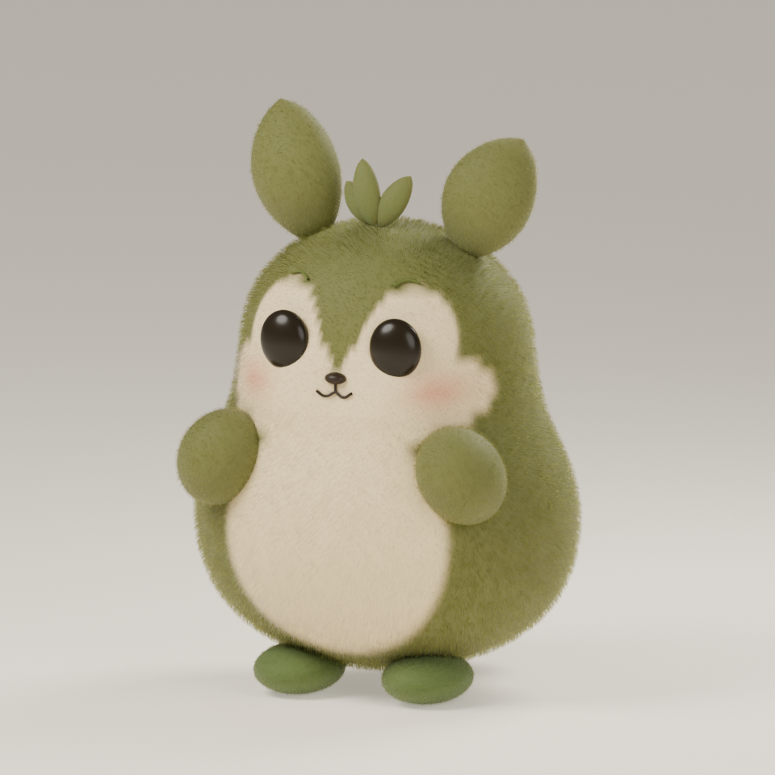

# A · Sprout — editable model review 01

Prepared 13 September 2026 with Blender **5.2.1 LTS**, build `9e2066aef7ef`.

The user selected **A · Sprout** from the [concept comparison](../../docs/concepts/character-study-01.png), then asked for the first Blender draft's face and colors to be brought closer to that concept. This revision has a tapered olive forehead, separate cream eye patches, fuller cheeks, visible peach blush, smaller eyes, and warmer olive/ivory materials. **The revision awaits user review. It is unrigged and unanimated.**



The compact pear-shaped body has two asymmetric leaf ears, three crown leaves, a cream face and belly, tucked paws, small feet, a rounded tail, dark glossy eyes, and short olive velvet. The concept remains a visual reference; this model is a newly built approximation with editable geometry and materials.

## Review files

- [Editable Blender model](review-01/sprout-design-v01.blend)
- [Front](review-01/sprout-v01-front.png), [three-quarter](review-01/sprout-v01-hero.png), [side](review-01/sprout-v01-side.png), [back](review-01/sprout-v01-back.png)
- [Build settings, source hashes, and artifact hashes](review-01/model-review.json)

The stills are 960 × 960 pixels with a studio floor and lighting. They are design views, not transparent production frames or calibrated desktop-size acceptance results. The model uses authoring units with its front facing −Y and its ground at Z = 0. The Blender file opens with the body selected and the hero camera framed. Use a Cycles render to inspect the full material; the solid viewport is a modeling aid.

## Edit or rebuild

Open the `.blend` file in Blender to edit the named body, limbs, leaves, face, and groom collections. The model has no external textures, linked libraries, or add-on dependencies. [build_design.py](scripts/build_design.py) retains the shape, palette, material, camera, and lighting parameters. [coat_fibers.py](scripts/coat_fibers.py) builds the short groom with native editable hair curves and a deterministic seed per object.

Rebuild into the ignored scratch directory from the repository root:

```sh
/Applications/Blender.app/Contents/MacOS/Blender \
  --background --factory-startup --python-exit-code 1 \
  --python art/sprout/scripts/build_design.py -- \
  --output-dir .build/art/sprout/review-01 \
  --resolution 960 --samples 64 --views hero,front,side,back \
  --fur --fur-density 9000
```

The script requires an isolated background process and verified Blender 5.2 APIs. It does not manipulate an open Blender session. Set a new output directory to preserve a manually edited model. Rebuilding constructs a fresh model from the script; it does not merge manual edits. Seeds and settings reproduce the design, while file hashes identify this particular saved output rather than promising identical binary files across machines or Blender builds.

The short coat uses Blender's native `CURVES` data and the Huang Principled Hair shader, which is [Cycles-only](https://docs.blender.org/manual/id/5.2/render/shader_nodes/shader/hair_principled.html). Its white first-reflection weight is deliberately reduced to 0.18 for the intended velvet color; this is an artistic adjustment from the physically correct default of 1. The undercoat sheen is 0.10. Five native material experiments informed this choice. The final pigment values are olive `63662E`, ivory `F1DBAB`, and leaf green `536730`, converted from sRGB to linear values for shading. AgX with Look None and exposure 0 is set explicitly.

The current groom follows rigid parent transforms. It is **not bound to a deforming surface**: body edits require regenerating it, and rigging must add an appropriate [surface-deformation binding](https://docs.blender.org/manual/en/5.2/modeling/geometry_nodes/curve/operations/deform_curves_on_surface.html). New material and world node trees are used directly; the deprecated `use_nodes` switch and legacy particle hair are not used. The body subdivision is applied before painting the face so sparse construction rings do not smear the markings. Eyes, brows, nose, and smile are positioned against the evaluated body surface.

## Next design decisions

Review the body width, ear length, eye proportions, forehead markings, olive color, and velvet texture against the selected concept. The current draft has simpler paws and a rounded tail. Those details remain adjustable; the user's request to refine the face and colors does not constitute approval of the rest of the model.

After the shape and face are accepted:

1. Review a turntable and calibrated small renders over light and dark backgrounds, including transparent edges.
2. Add body and limb controls, ear/crown motion, gaze, eyelids, and a deforming groom binding.
3. Review an idle → short walk → petting reaction → settle sample, with grounded feet and clean transitions.
4. Export frames with timing and anchor metadata, integrate the accepted sample, and measure the app with its real assets.

This model is an offline authoring asset. Its Blender rendering cost does not predict the native app's runtime cost. The app still displays procedural placeholder artwork; its existing checks do not validate this model or future animation assets.

## Verification

The retained model passed 14 checks in a fresh background Blender process covering editable geometry, the named cameras, groom data, rendering settings, hashes, and external dependencies. All four saved views were visually inspected. The [verification record](review-01/verification.json) identifies the results and saved model hash. Both foot meshes meet the studio floor at Z = 0. A few sole fibers extend below that plane and are hidden by the floor; the sole groom needs cleanup before transparent production exports.

These checks establish that the review artifact opens and renders; artistic approval, deformation quality, alpha edges, animation, and in-app performance remain pending.
