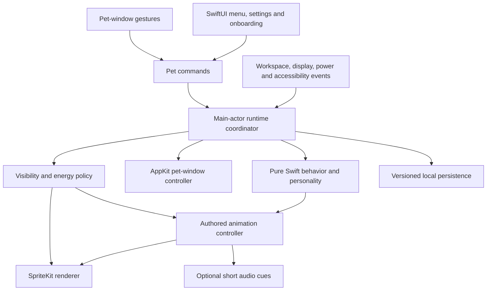

# Spriglet: researched product and engineering plan

Research checked on **13 September 2026**. Planning only; no application has been implemented or benchmarked.

Source brief: [Social Desktop Pet.md](</Users/ali/Library/Mobile Documents/iCloud~md~obsidian/Documents/Main/Social Desktop Pet.md>). The user confirmed **a local companion first**. Visual style remains a recommendation, not a final character-design decision.

The app is feasible. The main work is making a small character feel alive while behaving correctly alongside other Mac apps and consuming very little energy. The largest uncertainties are transparent-window input, window movement and compositing, Spaces/full-screen behavior, and the production cost of excellent animation. Those need an early prototype and an animation sample before a large feature or asset investment.

## 1. Recommended product

Build one memorable, private Mac companion. It walks short distances, looks around, rests, sleeps, reacts to petting, and performs a small number of playful actions. It remembers its name, placement, preferences, and modest personality changes locally. It should be enjoyable when ignored as well as when actively played with.

Start with a **soft, 3D-looking character rendered offline into 2D animation frames**. This is an art-production choice: create and animate a consistent model, render authored views with transparent backgrounds, and play the resulting frames in the app. My recommendation is based on this brief's combination of visual craft and low runtime cost; it is not a measured claim that this will always use less memory or power than real-time 3D.

| Approach | What it can look like | Strengths for this app | Cost or limitation |
|---|---|---|---|
| Authored 2D illustration | Graphic, painterly, hand-drawn, or gently shaded | Distinct identity and expressive poses | Consistent perspective and many directional poses require careful artwork |
| Offline 3D rendered into 2D frames — recommended | Rounded, softly lit, plush or sculpted | Consistent proportions and lighting; expensive visual detail can be baked into frames | Fixed authored viewpoints; decoded frame memory and transitions need active management |
| Real-time 3D | Can match the same visual style | Free rotation, dynamic lighting, continuous skeletal blending, richer interactions | More rendering, materials, rigging, and performance work; animation still needs authoring |

A still image cannot distinguish a pre-rendered 3D character from an equivalent real-time rendering. Real-time 3D is not automatically more attractive. Choose it if free viewpoints, procedural posing, or dynamic lighting become essential to the product.

[View the illustrative style comparison](/Users/ali/W/personal/spriglet/docs/concepts/style-comparison.png). It is a generated concept study, not a production model, rig, sprite sheet, or proof of animation quality. Its character design is provisional. [Generation prompt and provenance](/Users/ali/W/personal/spriglet/docs/concepts/style-comparison-prompt.md).

Initial product defaults:

- One pet on one selected display, with a command to move it to another display.
- A small companion above ordinary app windows, staying near a user-chosen resting area and moving within a limited region. Offer a parked mode immediately.
- Direct click/petting, drag/reposition, and a few menu-accessible play actions.
- Menu bar access to Show/Hide, Pause/Resume, Pet, Play, Recenter, Move to Display, Settings, and Quit.
- Settings for size, activity level, sound, placement, and optional launch at login. Sound and launch at login start off.
- A short first-run introduction that shows how to interact and hide the pet; the app works immediately.
- Sleep and calm behavior without a health meter, punishment for absence, streaks, or demands for attention.

The first version has no social service, accounts, cloud sync, chat, screen reading, app-content awareness, microphone, camera, activity surveillance, or downloaded executable behavior. Those are not dependencies of the brief.

## 2. What “latest Swift technologies” means for this project

Use the latest **stable, supported** toolchain at implementation time and explicitly evaluate the current release candidate. Do not equate a framework's age with deprecation. Adopt current APIs inside the frameworks that solve the problem; exclude deprecated APIs and avoid importing code from old tutorials without verification.

| Item | Verified state today | Planning decision |
|---|---|---|
| Installed development environment | macOS 26.6.2; Xcode 26.6 build 17F113; Apple Swift 6.3.3; Apple silicon | Ready for stable-toolchain prototyping |
| Latest stable Xcode listed by Apple | Xcode 26.6, Swift 6.3 compiler family, macOS 26.5 SDK | Reproducible baseline today |
| Newest Xcode listed by Apple | Xcode 27 RC, Swift 6.4, macOS 27 SDK; RC released September 9 | Compatibility and migration target, accurately labeled RC |
| Minimum app OS | Product decision, separate from compiler/SDK version | Recommend macOS 26.0+ and Apple silicon for v1; test macOS 27 too |

The local versions came from `sw_vers`, `xcodebuild -version`, and `swift --version`. Apple's [Xcode requirements table](https://developer.apple.com/xcode/system-requirements) distinguishes the stable and RC toolchains, and its [release list](https://developer.apple.com/news/releases/) establishes the RC date. The [Xcode 27 release notes](https://developer.apple.com/documentation/xcode-release-notes/xcode-27-release-notes) identify the Swift 6.4 compiler. Compiler version, Swift language mode, build SDK, and minimum deployment target are separate settings.

The minimum OS and Apple-silicon-only recommendation deliberately reduce the test matrix. They are not requirements of basic pet animation. If supporting older Macs matters commercially, decide that before implementation. Building with a new SDK does not require raising the deployment target to that SDK's OS.

At kickoff, recheck Apple's stable releases. If Xcode 27 has become stable, use that stable release after the prototype checks pass. If still an RC, use 26.6 for the stable baseline and test 27 separately. Do not install or switch tools merely as part of this planning task.

### Current and newly introduced capabilities worth adopting

| Technology | Relevance and adoption |
|---|---|
| Swift 6 language mode and strict concurrency checking | Enable from the start. Keep UI/window state on the main actor; make work that must execute elsewhere explicit. |
| Approachable Concurrency | Use main-actor default isolation for the app/UI target and explicitly choose isolation for the pure domain package. `async` alone is not an instruction to run work off the main actor. Use `@concurrent` for suitable heavy work. See [Swift's concurrency changes](https://www.swift.org/blog/swift-6.2-released/). |
| Observation | Use `@Observable`, `@State`, `@Environment`, and `@Bindable` for UI state. Keep per-frame animation state outside broad SwiftUI observation. Apple's [model-data guidance](https://developer.apple.com/documentation/swiftui/managing-model-data-in-your-app) supports this model/view separation. |
| Typed notifications | On macOS 26, use supported `NotificationCenter.MainActorMessage` / `AsyncMessage` APIs and typed workspace messages. Retain observation tokens for the intended lifetime. See [MainActorMessage](https://developer.apple.com/documentation/foundation/notificationcenter/mainactormessage) and [ScreensDidSleepMessage](https://developer.apple.com/documentation/appkit/nsworkspace/screensdidsleepmessage). |
| SwiftUI 26 | Native controls, appropriate Liquid Glass surfaces, current animation facilities, and SwiftUI/AppKit integration. Keep the pet itself free of a glass backing. See [SwiftUI updates](https://developer.apple.com/documentation/updates/swiftui). |
| SwiftUI 27 / Xcode 27 | The new `@State` macro avoids repeated class initialization, and `ContentBuilder` unifies content builders. Review source compatibility during migration. Input-kind selection may help pointer/Sidecar handling. These do not remove the need to prove the desktop overlay. See [SwiftUI updates](https://developer.apple.com/documentation/updates/swiftui). |
| AppKit's current Swift integration | Use Observation in appropriate AppKit lifecycle methods. New 2026 gesture/control improvements are relevant if richer input is added. See [AppKit updates](https://developer.apple.com/documentation/updates/appkit) and [automatic observation tracking](https://developer.apple.com/documentation/appkit/updating-views-automatically-with-observation-tracking-in-appkit). |
| Swift 6.4 tooling | Evaluate the unified SwiftPM build implementation when moving to 6.4. Language improvements are useful selectively, not reasons to complicate the domain model. See Apple's [Swift group lab](https://developer.apple.com/videos/play/wwdc2026/8001/). Swift 6.3's integration was still a [preview](https://www.swift.org/blog/swift-6.3-released/). |
| Current profiling and previews | Use `#Preview`; Xcode 27 deprecates `PreviewProvider`. Evaluate its Swift Executors instrument and new VoiceOver UI automation during the upgrade. See [Xcode 27 release notes](https://developer.apple.com/documentation/xcode-release-notes/xcode-27-release-notes). |

Availability must be checked per symbol. For example, `NSWorkspace.ScreensDidSleepMessage` is available on macOS 26, while [`NSWindow.DidChangeOcclusionStateMessage`](https://developer.apple.com/documentation/appkit/nswindow/didchangeocclusionstatemessage) is macOS 27+. On 26, use the supported window delegate/notification mechanism for that event. A small supported adapter is preferable to silently making the app 27-only.

### Technologies to exclude or reserve

- **SceneKit:** deprecated; Apple directs new 3D work to RealityKit. If real-time 3D is selected later, evaluate [RealityKit](https://developer.apple.com/documentation/realitykit) and prove its transparent-window and idle behavior. See [SceneKit's deprecation](https://developer.apple.com/documentation/scenekit/).
- **CVDisplayLink:** the installed SDK marks it deprecated from macOS 15 and names AppKit's display-link methods as replacements. Use [`NSView.displayLink(target:selector:)`](https://developer.apple.com/documentation/appkit/nsview/displaylink(target:selector:)) when an app-managed display clock is needed. One [older Metal sample](https://developer.apple.com/documentation/metal/creating-a-custom-metal-view) still says `CADisplayLink` is unavailable on macOS; that statement is superseded by the current API.
- **Old login helpers:** use `SMAppService`, not `SMLoginItemSetEnabled` or hand-installed launch-agent plists. See [Service Management](https://developer.apple.com/documentation/servicemanagement/smappservice).
- **Legacy scene-animation timing:** if using SpriteKit, use `preferredFramesPerSecond`, not its deprecated frame-rate properties. See [SKView](https://developer.apple.com/documentation/spritekit/skview).
- **Old SwiftUI model patterns:** prefer Observation for new app state. This is an architectural choice; it does not mean Combine itself is deprecated.
- **Custom Metal renderer:** keep as a measured fallback. [Metal 4](https://developer.apple.com/documentation/metal/understanding-the-metal-4-core-api) is current and useful for explicit rendering control, but its additional machinery is not automatically a benefit for one animated character.
- **Foundation Models:** investigate only for a later, optional language feature. The 2026 framework adds model-provider flexibility and richer sessions; “Foundation Models” no longer necessarily means exclusively on-device inference. See [Foundation Models updates](https://developer.apple.com/documentation/updates/foundationmodels). Any local-only extension must deliberately select an on-device model, check [availability](https://developer.apple.com/documentation/foundationmodels/systemlanguagemodel/availability-swift.property), and work without it.

## 3. Feasibility and boundaries

These ratings combine documented API capabilities with engineering judgment. They do not replace a running prototype.

| Capability | Assessment | Constraint or acceptance condition |
|---|---|---|
| Transparent, borderless desktop pet | Feasible with public APIs | A small nonactivating `NSPanel` hosts the rendering view. |
| Remain present while another app has focus | Feasible | Pet interaction must not steal keyboard focus; renderer must work while the app is inactive. |
| Walk, rest, sleep, respond, develop personality | Feasible | Author behavior and transitions explicitly; animation quality depends on assets. |
| Retina rendering and high refresh rates | Feasible within a device budget | Profile actual presentation cadence at 60/120 Hz. Art-frame rate and screen refresh rate differ. |
| Multi-monitor support | Feasible | Handle scale differences, negative desktop coordinates, unplug/replug, and saved placement. Start with one pet on one display. |
| Spaces and Stage Manager | Feasible with qualifications | Collection behaviors express preferences; verify the required combinations on supported OS versions. |
| Always visible over every full-screen app or system surface | Not a promise we should make | macOS owns system UI and protected surfaces. Default to unobtrusive full-screen behavior. |
| Exact click-through around an irregular animated silhouette | Prototype required | Window-level click-through is documented; per-pixel input behavior across a GPU-backed transparent view is not established by that fact. |
| Entire window click-through | Feasible | Direct interaction with that window is then unavailable; menu controls remain available. |
| Walking along the screen's usable edge | Feasible | Respect Dock, menu bar, notch, and hot-corner margins. |
| Walking on arbitrary other apps' live window edges | Separate, high-risk feature | Robust tracking introduces cross-app observation, compatibility, permission, and sandbox issues. It is outside v1. |
| Understanding documents, websites, or what the user is doing | Outside the private v1 | Requires collecting content or signals that the current brief does not require. |
| Guaranteed exclusion from every screenshot or meeting recording | Not supported as a product guarantee | Provide a manual Hide command. The old `NSWindow.SharingType.none` route is now a legacy no-op. |
| Near-zero work while hidden or paused | Achievable target | Stop clocks, scene updates, audio, and unnecessary scheduled work; verify in Instruments. |
| Continuous animation at literally zero energy cost | Impossible | Rendering and compositing require work; “no meaningful drain” needs a measured definition. |
| Mac App Store distribution | Plausible, conditional on implementation and review | Preserve sandbox compatibility and user-controlled startup; review is not guaranteed. |

Apple explicitly provides a [nonactivating panel style](https://developer.apple.com/documentation/appkit/nswindow/stylemask-swift.struct/nonactivatingpanel), [window mouse transparency](https://developer.apple.com/documentation/appkit/nswindow/ignoresmouseevents), and [overlay-oriented collection behavior](https://developer.apple.com/documentation/appkit/nswindow/collectionbehavior-swift.struct/canjoinallapplications). The last applies to eligible full-screen and Stage Manager contexts, not every system surface.

The cross-app boundary is material: Apple's [sandbox documentation](https://developer.apple.com/documentation/security/protecting-user-data-with-app-sandbox) lists assistive accessibility API use among incompatible activities. Supporting VoiceOver in our own app is a different capability and belongs in v1. Screen-content capture is another separate feature with its own [permission model](https://developer.apple.com/documentation/screencapturekit/capturing-screen-content-in-macos). Neither belongs in the core pet implementation.

For capture exclusion, Apple's current description of [`SharingType.none`](https://developer.apple.com/documentation/appkit/nswindow/sharingtype-swift.enum/none) explicitly says macOS no longer uses it. Do not base “hide during sharing” guarantees on old snippets using that constant.

## 4. Proposed implementation

Use a native Xcode macOS application and one small local Swift package for the testable pet domain. Keep logical subsystems as folders/types initially rather than splitting into many frameworks. Start without third-party runtime dependencies.

| Responsibility | Proposed implementation |
|---|---|
| App lifecycle and standard UI | SwiftUI `App`, `MenuBarExtra`, `Settings`, and a narrowly scoped `NSApplicationDelegateAdaptor` / coordinator bridge |
| Desktop window | Retained `NSPanel` controller; borderless, transparent, nonactivating; explicit window level and collection behavior |
| 2D playback | `SKView`, `SKScene`, sprite nodes, and small texture atlases |
| Personality and behavior | Pure Swift value types, an explicit state machine, and weighted action selection with cooldowns |
| Frame and transition control | Renderer-facing controller with an injectable clock, authored markers, and a consistent pose/root-motion timeline |
| UI observation | Low-frequency `@Observable` presentation state; no per-frame position updates through the settings view tree |
| Persistence | `@AppStorage` for preferences; a small versioned `Codable` pet snapshot in Application Support with serialized, atomic writes |
| Sound | Short file/buffer playback with `AVAudioPlayer`; upgrade only if audio requirements demand it |
| Login | User-operated `SMAppService.mainApp` registration with real status/error handling |
| Diagnostics | Unified logging and signposts around transitions, texture loads, presentation, and save operations |
| Tests | Swift Testing for domain/integration tests; XCTest/XCUIAutomation for UI and performance tests |

SpriteKit is a currently documented, Metal-backed 2D framework, and its framework metadata has no deprecation marker in the documentation checked today. It is the first renderer to evaluate, not a performance result. [SpriteKit](https://developer.apple.com/documentation/spritekit) and [SKView](https://developer.apple.com/documentation/spritekit/skview) support this choice.

`MenuBarExtra` supports access while the app is inactive, and Apple documents `LSUIElement` for a menu-bar-only utility. Account for relaunch/recovery if the user removes the extra. See [MenuBarExtra](https://developer.apple.com/documentation/swiftui/menubarextra). Use Apple's current [AVAudioPlayer](https://developer.apple.com/documentation/avfaudio/avaudioplayer) for the limited sound requirement.

SwiftData is modern and valid, but one pet does not yet require queries or an object graph. Keep the small persisted snapshot behind a storage interface; adopt [SwiftData](https://developer.apple.com/documentation/swiftdata) if a meaningful journal, collection, or relationship model emerges. `@AppStorage` remains a supported [preferences API](https://developer.apple.com/documentation/swiftui/appstorage).

### The window/input prototype is the first engineering gate

Use a pet-sized window, including enough room for ears, tail, and shadow. Measure moving that window across the desktop. A screen-sized transparent GPU surface may simplify coordinate animation but can create large surfaces and intercept input across a much larger area; it should not be the untested default.

Test these behaviors together:

1. Click and drag the pet while typing in another app; the active app retains keyboard focus.
2. Click transparent areas around the pet; underlying apps receive the click if that is the intended product behavior.
3. Verify whether alpha-based input works with the actual renderer. Returning `nil` from an `NSView` hit test is not, by itself, proof of cross-process click forwarding.
4. Exercise menus, pointer entry/exit, mouse-down/mouse-up sequences, and a pet walking beneath a stationary pointer.
5. If exact silhouette input is unreliable, establish a small predictable interaction region or an explicit pass-through mode. Do not compensate with screen-wide input interception, event reposting, or a permanent mouse-polling loop.
6. Test Spaces, Mission Control, Stage Manager, full-screen entry/exit, and Show Desktop. Choose a documented collection-behavior combination after observing results; some [collection flags are mutually exclusive](https://developer.apple.com/documentation/appkit/nswindow/collectionbehavior-swift.struct).
7. Test movement and rendering together at 60/120 Hz before promising smooth desktop travel. Synchronize root position and pose from one presentation timeline and avoid unrelated frame clocks.

Use [`NSScreen.visibleFrame`](https://developer.apple.com/documentation/appkit/nsscreen/visibleframe) and current display geometry. That rectangle excludes occupied Dock/menu-bar areas and camera-housing regions, and Apple warns against caching it indefinitely. Store placement in screen-relative terms; revalidate bounds at movement start and after display/space changes. If a saved screen disappears, return the pet safely to an available screen.

The prototype must run sandboxed with no Screen Recording, Input Monitoring, Accessibility-control, or Automation permission grants. If a tested interaction unexpectedly requires one, redesign the interaction before expanding the permission footprint.

## 5. Behavior and animation design

Separate **what the pet wants to do** from **how that action is animated**. A state machine owns legal actions; an animation controller owns poses, root position, facing, timing, and safe transition points.

Suggested initial states: resting, looking, walking, turning, settling, sleeping, waking, reacting to petting, being repositioned, and playing. Add two or three infrequent signature actions only after this set feels coherent.

Personality can come from a small persistent trait set: curiosity, energy, sociability toward its owner, preferred activity, and a stable random seed. Recent interactions influence bounded action weights and cooldowns. This is authored adaptation, not a claim of machine learning or emotional understanding.

An example sequence: the pet wakes, looks around, takes a short walk toward its preferred resting spot, settles, and later performs a tiny ear motion. Repeated petting may make a happy response more likely for a while. It should not immediately repeat the same special action or become distressed because the app was closed.

Behavior decisions happen on events and scheduled deadlines. The renderer samples active motion at the presentation cadence; the behavior engine does not choose a new action 120 times per second. Use one cancellable next-decision task with appropriate tolerance. When nothing can change, schedule no recurring decision timer.

Each authored clip needs:

- Frame timing, source-frame bounds, and ground/contact anchor.
- Facing direction and whether mirroring is actually permitted.
- Entry pose, exit pose, valid transition targets, and interrupt markers.
- Root-motion data or the expected movement curve and stride relationship.
- Sound markers, loop limits, and any allowed timing variation.
- Foot/contact markers so walking speed and foot placement stay consistent.
- Asset version and an agreed coordinate/alpha convention.

Use authored turns for asymmetric characters. Never assume flipping the image preserves markings, lighting, or handedness. Keep ground anchors stable across differently cropped frames. Randomize action selection, pauses, and carefully bounded timing without independently changing playback speed and translation until the feet slide.

Animate reactions at authored boundaries; ensure commonly interruptible clips offer a prompt boundary. User-requested Hide, Pause, and Quit suspend output immediately and do not wait for a dramatic animation to finish. On resume, preserve a legal pose and avoid replaying elapsed sleep time as a burst of actions.

The initial content target is roughly **10–14 behavior families**, not a promise that only 10–14 clips are needed. Left/right views, entry/exit transitions, reactions, and interruptions can multiply the clip count. Establish the actual list after the first character and transition sample.

### Art-production requirements

Commission or create one canonical character model/rig and an editable animation source. Choose a fixed camera convention, consistent soft lighting, contact shadow, color space, and export scale. Use an organized RGBA sequence/atlas pipeline with metadata. Keep original source files and commercial usage rights documented.

First deliver an idle → look → walk → stop → turn → settle sequence, plus a petting reaction and sleep/wake. Review it at the intended small desktop size on both light and dark backgrounds. Do not approve an art direction solely from a large marketing render.

Pre-rendering trades runtime scene complexity for asset memory and fixed viewpoints. Avoid exporting every action at unnecessarily large resolutions. For scale, one uncompressed 512 × 512 RGBA8 frame is 1 MiB; 120 such frames are 120 MiB before mipmaps, atlases, retained CPU copies, or renderer overhead. A compressed PNG's disk size is not its decoded texture footprint. These are arithmetic estimates, not measurements of Spriglet.

Load the currently needed action set and a small next-action cache. Validate atlas edges, padding, premultiplied alpha conventions, contact-shadow fringes, Retina scale, and fractional positioning. Reuse resources and avoid texture decoding in the presentation callback.

Generative images are useful for concept exploration. The generated comparison does not provide the canonical rig, consistent animation frames, transition metadata, or asset-license review required for production.

## 6. Energy and performance contract

Replace vague goals with provisional, measurable budgets. These are targets to validate on a baseline Apple-silicon Mac, not performance guarantees or Apple's recommended numeric limits.

| State or metric | Proposed acceptance target |
|---|---|
| Explicitly hidden or paused, after settling | Zero scheduled render/behavior ticks and no continuous audio; aim for ≤0.1% CPU averaged over five minutes, excluding unrelated system activity |
| Fully static visible pose | No continuous animation loop; redraw only when necessary and wake for the next authored event |
| Typical visible calm behavior | Aim for <1% of one CPU core averaged over ten minutes on the baseline Mac; measure GPU and WindowServer impact separately |
| Brief active animation | Stable display pacing; target p95 app update/encode work under 4 ms at 60 Hz or 2 ms at 120 Hz, then verify actual presented frames |
| Input | Target visible acknowledgement within 100 ms; movement enters an authored transition promptly |
| Launch | Target a usable menu and first pet pose within one second after a normal warm launch; measure cold launch separately |
| Memory | Initial target ≤150 MiB physical footprint with one pet and typical action cache; aim lower after assets are fixed |
| Soak stability | No retained-growth trend; after a 30-minute warmup, target final 30-minute median within 5 MiB of the initial warmed median during an eight-hour repeatable run |
| Texture cache | Start with a decoded-resource budget around 32–48 MiB; revise from the smallest satisfactory art sample and measured renderer overhead |
| Low Power Mode | Fewer autonomous actions; cap active rendering at 30 fps as a starting policy; maintain responsive controls |
| Serious/critical thermal pressure | Park or pause the pet and suppress nonessential effects; restore gently when conditions improve |

The CPU figures use 100% = one fully occupied CPU core. Record OS, hardware, display count, scaling, refresh rate, app build, power source, and measurement method beside every result. Activity Monitor percentages alone are insufficient for validating battery impact.

Use Time Profiler, Allocations/Leaks, relevant GPU/Metal tracing, and signposts. Compare whole-system behavior with the pet running, paused, and absent under repeatable brightness/workload conditions; include WindowServer cost. Establish an acceptable measured power delta during the prototype instead of inventing a battery-hours guarantee. Apple's [rendering-efficiency guidance](https://developer.apple.com/documentation/xcode/improving-your-app-s-rendering-efficiency) recommends ending unnecessary animation and rendering work.

There are several easily missed lifecycle details:

- App inactivity does not imply the pet is invisible. Do not pause simply because another application is active. Apple's [`SKView.isPaused` documentation](https://developer.apple.com/documentation/spritekit/skview/ispaused) describes automatic changes on app activation; test and handle this for an ambient app.
- A paused scene is not proof of zero render callbacks or GPU submissions. Measure both. Stop the renderer's work, not just its animation state.
- A fully transparent or irregular window may still be reported visible because of its bounding box. Use explicit hidden/paused state plus window/workspace events; do not rely on [occlusion state alone](https://developer.apple.com/documentation/appkit/nswindow/occlusionstate-swift.struct).
- Respond to display sleep, system sleep/wake, session changes, and display removal. Do not request a permanent activity assertion to defeat normal power management.
- Read and observe [Low Power Mode](https://developer.apple.com/documentation/foundation/processinfo/islowpowermodeenabled) and [thermal state](https://developer.apple.com/documentation/foundation/processinfo/thermalstate-swift.property).
- Honor the display's capabilities rather than assuming 120 Hz. [`maximumFramesPerSecond`](https://developer.apple.com/documentation/appkit/nsscreen/maximumframespersecond) is a capability limit; it is not proof of the actual cadence delivered.

If SpriteKit cannot meet the idle or presentation targets in the real panel, run a bounded renderer comparison. A lightweight Core Animation presentation may suit frame replacement, while [`MTKView`](https://developer.apple.com/documentation/metalkit/mtkview) has documented explicit/demand-driven drawing modes. Keep `PetRenderer` narrow enough to replace the backend. Choose from measurements of the same assets and window configuration, and revisit Metal 4 support if a custom renderer is selected.

## 7. Accessibility, privacy, and persistence

Provide complete keyboard/menu alternatives for petting, play, repositioning, and pause. Expose a labeled pet accessibility element and useful actions; do not announce every pose or position change. Controls need clear labels, visible focus, contrast, and usable hit targets.

With Reduce Motion enabled, default to a parked companion with restrained pose changes instead of roaming or bouncing. Honor the separate sound setting and avoid representing state only with color. React when settings change using the supported [Reduce Motion and accessibility notifications](https://developer.apple.com/documentation/appkit/nsworkspace/accessibilitydisplayshouldreducemotion).

Store only the pet's own state. No global keyboard events, clipboard reads, app titles, screenshots, or user-work records. No backend or runtime network dependency is needed. Keep diagnostics local by default and avoid logging private user-supplied names unnecessarily.

The saved state should include a schema version, pet identity/name, stable traits, a bounded set of learned preferences, placement, and settings as appropriate. Serialize writes away from frame callbacks, coalesce changes, and save at meaningful milestones. Use atomic replacement and a recoverable last-good snapshot. Handle incompatible/corrupt state without a launch crash. Closing the app for a week should not penalize the pet or trigger a long simulation on relaunch.

For distribution, accurately describe collected data and audit privacy-manifest requirements against the final target/platform and actual API use. `@AppStorage` uses UserDefaults; inspect that use even though Apple currently describes required-reason declarations differently across platforms. See [privacy manifest files](https://developer.apple.com/documentation/bundleresources/privacy-manifest-files) and [UserDefaults guidance](https://developer.apple.com/documentation/foundation/userdefaults). Do not infer that a private app can skip every distribution privacy requirement.

## 8. Build sequence and decision gates

Assumption for estimation: one experienced macOS engineer, a capable character animator/artist available, full-time development, one pet, and no social/backend work. The ranges below are planning estimates, not sourced delivery guarantees. Art revisions and native-window issues are the largest variables.

| Phase | Indicative effort | Deliverable and gate |
|---|---|---|
| 0. Product and art sample | 2–4 working days of coordination, plus artist turnaround | Confirm resting behavior, size, style, provisional clip list, and an animated sample at desktop scale |
| 1. Window and renderer feasibility | 4–7 engineering days | Sandboxed transparent window; focus/input tests; multi-screen movement; initial CPU/GPU/memory traces. Stop feature expansion if the core interaction is unreliable. |
| 2. One polished vertical slice | 1–2 weeks | Launch → idle → walk → petting response → settle; one coherent animation timeline; working pause/hide and save/restore |
| 3. Behavior and native product | 1–2 weeks | Bounded personality, action selection, settings, menu controls, display recovery, accessibility, optional login |
| 4. Production animation integration | 2–4 weeks, partly overlapping phases 2–3 | Complete authored clips and transitions; resource budgets; subtle optional sound; animation review tools |
| 5. Performance and beta hardening | 1–2 weeks | Soak tests, real 60/120 Hz devices, sleep/wake and display matrix, usability feedback, regression fixes |
| 6. Release preparation | 3–5 working days, plus external review time | Signing/distribution, privacy and help text, launch/login/uninstall checks, release candidate |

Budget approximately **8–12 calendar weeks for a polished first release** when artwork overlaps engineering, with meaningful uncertainty. A convincing technical/visual prototype is a roughly 1–2 week milestone. A first-time Swift developer or one person also learning character modeling/animation should plan materially longer; 12–20+ weeks is more realistic as an initial allowance. Establish a firmer estimate after phases 0–1.

Use explicit go/no-go gates:

1. **Window/input:** the pet coexists with real apps, recovers from screen changes, and does not steal focus or broadly block clicks.
2. **Art:** the small character and transition sample meet the brief on light/dark desktops.
3. **Energy:** hidden/paused work actually stops; visible animation fits the measured budgets or there is a validated renderer replacement.
4. **Product:** users can understand, interact with, park, and hide the pet without explanation or annoyance.
5. **Release:** the supported OS/display matrix, persistence, accessibility, signing, and distribution checks pass.

If a gate fails, narrow the movement range, interaction geometry, art scale, or animation frequency before adding more behavior.

## 9. Verification plan

Test meaningful behavior, not framework internals or trivial settings assignments. Apple's current guidance recommends [Swift Testing](https://developer.apple.com/documentation/testing) for new unit tests while retaining [XCTest for UI and performance tests](https://developer.apple.com/documentation/xctest/).

Domain tests with an injected clock and seeded randomness should verify legal transitions, repeat suppression/cooldowns, bounded traits, long absence, pause/resume, queued reactions, and timestamp jumps. Asset validation should catch missing frames/markers, impossible transitions, inconsistent anchors, and unsupported mirrored clips before runtime.

Integration tests should exercise missing/corrupt snapshots, schema migration, interrupted writes, resource eviction, login-state failures, removal/readdition of a display, and reopening after Hide/Quit. Add UI automation for settings, menu actions, and accessibility where supported. Keep native desktop transitions in a documented manual test matrix as well; automated clicks alone cannot establish all window behavior.

The release matrix needs:

- The minimum supported macOS 26 release and current patched 26; macOS 27 on real hardware before claiming support.
- A baseline Apple-silicon Mac, a ProMotion display, and a 60 Hz external display.
- Mixed scaling/refresh rates, displays on either side/above the main display, Dock on different edges, auto-hide, and camera-housing margins.
- Spaces switching, Stage Manager, Mission Control, Show Desktop, full-screen apps, sleep/wake, lock/session switching, and display unplug/replug.
- Active typing and clicking in another app while the pet moves or reacts.
- VoiceOver, keyboard-only use, Reduce Motion, increased contrast, sound off, Low Power Mode, and heavy system load.
- Eight-hour behavior and memory soak, plus repeated pause/hide/show/sleep transitions.

Keep a development-only animation inspector that can select a clip, scrub time, display anchors and transition markers, lock random seeds, and overlay frame/resource counters. This tool makes art review and timing bugs reproducible and is likely more valuable than adding more pet features early.

## 10. Distribution, resources, and outstanding decisions

Design for the Mac App Store sandbox from the first prototype, preserving the option of Developer ID distribution. For a consumer companion, the store is a reasonable initial recommendation because installation and updates are familiar; the distribution decision can wait until the feasibility gate.

Mac App Store rules require sandboxing and consent for automatic startup, and prohibit leaving processes running after Quit without consent. See [App Review Guidelines 2.4.5](https://developer.apple.com/app-store/review/guidelines/). Make Quit fully stop the pet, its audio, timers, and app-owned helper work.

For direct distribution, use Developer ID signing, Hardened Runtime, notarization, and a stapled distributable. Use Xcode's supported flow or `notarytool`; do not copy old `altool` notarization workflows. See [Apple's notarization guidance](https://developer.apple.com/documentation/security/notarizing-macos-software-before-distribution). Select an update mechanism if direct distribution is chosen rather than leaving updates undefined.

Resources needed:

- The existing Apple-silicon development Mac and installed Xcode are sufficient to begin.
- Access to additional physical display/hardware configurations for profiling and validation.
- One editable character source/rig, an animation-production workflow, final asset rights, and optional licensed short sounds.
- An Apple Developer account for the selected public distribution route. The program currently lists **US$99 per membership year**, with regional pricing differences: [membership terms](https://developer.apple.com/programs/enroll/).
- App icon, a short onboarding/help flow, distribution screenshots, accurate privacy information, and a small group of beta users willing to keep the pet running through a workday.

There is no required server bill, paid AI inference, analytics service, or social infrastructure for the confirmed v1. Labor and character animation are the main variable costs. Do not quote a project cash budget without an artist quote and an agreed engineering schedule.

Decisions already resolved: local companion first; research-backed modern Swift stack; planning before implementation.

Recommendations awaiting eventual product selection: the 3D-rendered visual direction and final character; macOS 26+/Apple-silicon-only support; how far the pet roams; above-app default versus a quieter placement option; store versus direct distribution; and monetization. These do not block the written plan. The window prototype should make the window/input options concrete before further choices are requested.

Future social features require their own scope: identity, networking/sync, consent, abuse prevention, and ongoing service operation. Preserve a clean local domain model but do not build speculative backend abstractions now.

## 11. Evidence and implementation discipline

The repository initially contained only a minimal README, with no Swift app or tests. No applicable `AGENTS.md` was found in the project or inspected ancestor chain. Research used Apple Developer documentation, WWDC materials, Swift.org, the current official release tables, and installed SDK headers. No third-party tutorial was used as the basis of an API recommendation.

The strongest conclusions are the toolchain versions, documented APIs, and explicit deprecations. Renderer efficiency, exact click-through, desktop travel smoothness, full-screen behavior, App Store acceptance, art effort, and numeric budgets remain prototype- or review-dependent. Recommendations and estimates throughout this plan are identified as such.

At implementation and before each release: recheck current stable versions, confirm symbol availability/deprecation in that SDK, build in Swift 6 mode, resolve first-party deprecation warnings, and rerun the relevant behavior/energy checks after any toolchain or windowing change. A “latest” plan must be refreshed as releases change; it cannot make a permanent promise that today's selected APIs will never be deprecated.
