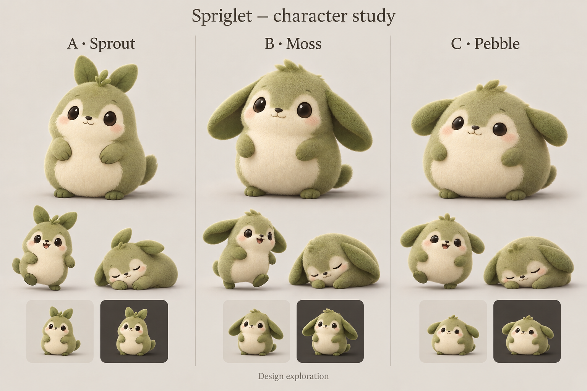

# Spriglet character design: review 01

Prepared 13 September 2026. **The user selected A · Sprout.** This is the historical concept checkpoint. The user subsequently asked to finish the playable sample with the revised face and colors; see the [current character sample](../character-sample.md) for its editable rig, finished clips, native review, and validation. The pending steps below describe the earlier checkpoint, not current implementation status.

The [original researched plan](../app-plan-2026-09-13.md), [earlier style comparison](style-comparison.png), and [original prompt](style-comparison-prompt.md) were restored from this task's saved creation records and original generated image. The original plan is historical: its statement that no app has been implemented describes the initial planning session. [Phase 3 validation](../phase-3-desktop-reliability.md) records the procedural prototype that preceded the current rendered character.

## Choose a base character

| Candidate | Design character | What to examine in the 3D sample |
| --- | --- | --- |
| A · Sprout | Upright leaf ears, a sprout crown, compact pear-shaped body; curious and distinctly botanical | Crown/ear readability at desktop size, room for head motion, an uncluttered silhouette |
| B · Moss | Long drooping leaf ears, cream face and belly; soft and affectionate | Ear motion and body overlap, overall width, face readability during turns |
| C · Pebble | Lower and rounder body, shorter side ears; relaxed and sleepy | Clear feet during walking, expressive range beyond the resting pose |

The user explicitly selected **A · Sprout** after reviewing the comparison. Its crown and upright ears provide the intended distinct silhouette. This is an art-direction judgment, not a measured usability result. Detailed proportions, surface material, and animation remain open for review against the actual Blender model.

The board is an image-generation concept study. Its poses and miniature background tiles help compare designs; they do not prove rig feasibility, exact pose consistency, calibrated desktop-size readability, clean exported alpha, or animated performance. The [exact prompt and provenance](character-study-01-prompt.md) are retained.

## Proposed visual principles

- One original woodland companion with a moss-green body, cream face/belly, dark expressive eyes, and a simple silhouette.
- Soft, short velvet material with controlled highlights and restrained surface detail; judge detail at the intended small size.
- Consistent camera, lighting, proportions, ground anchor, and contact shadow across authored poses.
- A calm and curious expression, with personality communicated through ears, gaze, body pose, and timing.
- The selected geometry, material, and proportions remain editable in the canonical Blender file.

These are proposals for review. Final shape, eye proportions, material detail, and palette should be confirmed against Blender renders before producing the full animation library.

## Tool access verified

The user made Blender available on this Mac. `/Applications/Blender.app/Contents/MacOS/Blender --version` reports **Blender 5.2.1 LTS**, build hash `9e2066aef7ef`, dated 25 August 2026. A background process using factory startup successfully executed a short `bpy` script, reported version `5.2.1 LTS`, and exited normally. This verifies local scripting access; no model or animation was created by that check.

The official [download page](https://www.blender.org/download/) and [5.2 release page](https://www.blender.org/releases/5-2/) list this stable LTS release and an Apple-silicon macOS build. New production scripts will be checked against the installed Python API and current Blender documentation.

Blender will supply the editable model, rig, animation, and rendered frames. After Effects is optional for later compositing or presentation work. No additional application account or connector is needed for the current modeling workflow. The Swift app continues to consume rendered assets; Blender is an offline authoring tool.

## First actual Blender model

The [editable model review](../../art/sprout/README.md) now includes a canonical `.blend` file, reproducible authoring scripts, and neutral front, three-quarter, side, and back renders. This is a first 3D interpretation of the selected concept. It has editable native mesh geometry, materials, cameras, and short hair curves. The user requested that the first draft's face and colors be brought closer to A. The revised model has fuller cream cheeks, peach blush, a tapered olive forehead, smaller eyes, and warmer materials with reduced white reflection. The model remains unrigged and unanimated; the revision awaits the user's feedback before rigging.

## Work after the base design is selected

1. **Model draft created; review pending.** Compare its proportions and material with the selected concept using the four actual Blender views.
2. Review a turntable and small-size renders. Refine the actual 3D design with the user before committing to the full rig and clip library.
3. Rig the body, limbs, ears/crown, gaze, and eyelids for the agreed design. Define ground anchors and facing conventions.
4. Author the first idle → short walk → petting reaction → settle sample, including clean movement starts/stops and synchronized foot contact. Review the animation itself with the user.
5. Export versioned frames and timing/anchor metadata, then integrate the approved sample into the native app and remeasure it with the real assets.

The sample is ready when the user accepts its appearance and motion at desktop size, its transitions stay grounded without visible snapping or foot sliding, alpha edges work over known light/dark backgrounds, and the renderer returns to rest when motion ends. The unresolved physical desktop checks in the current validation matrix remain separate gates before expanding the asset library.

## Checkpoint verification

- The three-column comparison was visually inspected for labels, candidate distinctions, pose coverage, and small light/dark previews.
- The original images were copied intact into the repository, with their generation provenance retained.
- Blender version and local Python execution were verified.
- Application source and production assets are unchanged at this review checkpoint; existing app measurements do not establish the future Blender assets' resource cost.
